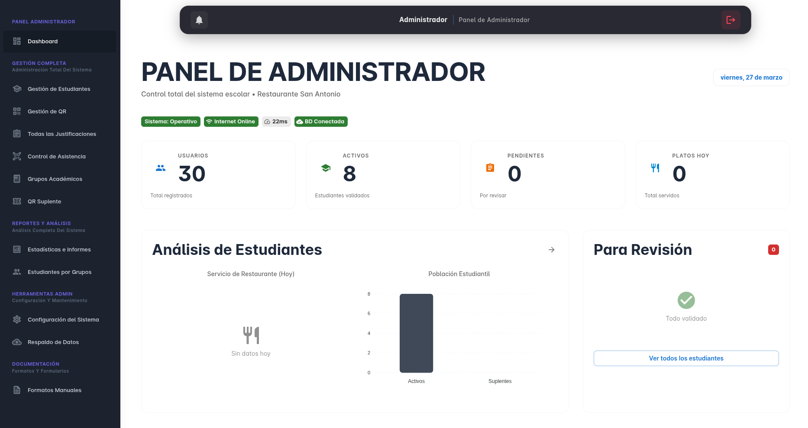
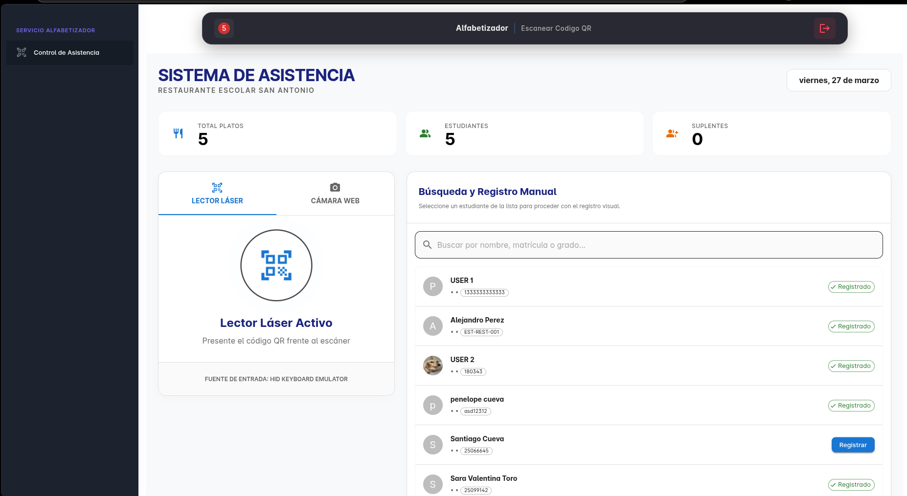

# 🍽️ Restaurante Escolar Pro - Gestión Unificada

¡Bienvenido a **Restaurante Escolar Pro**! Una solución integral y moderna diseñada para automatizar el control de asistencia y la gestión administrativa de comedores escolares. Este sistema utiliza tecnología de vanguardia como **códigos QR**, **WebSockets en tiempo real** e **IA** para facilitar la vida de directivos y alumnos.

---

## ✨ Características Principales

- **🛡️ Gestión de Usuarios**: Roles diferenciados para Admin, Secretarias, Docentes, Estudiantes y Acudientes.
- **QR Control de Asistencia**: Escaneo ultra-rápido mediante cámara web o lectores físicos de códigos QR.
- **📊 Dashboard en Tiempo Real**: Visualización dinámica de estadísticas de asistencia diaria y mensual.
- **🤖 Asistente con IA (Gemini)**: Soporte inteligente integrado para consultas administrativas y reportes.
- **📄 Reportes PDF**: Generación automática de reportes de asistencia y certificados.
- **📱 Responsive Design**: Interfaz moderna basada en React que se adapta a cualquier dispositivo.

---

## 🛠️ Tecnologías Utilizadas

- **Frontend**: React.js, Vite, Tailwind CSS, Lucide React.
- **Backend**: Node.js, Express.js.
- **Base de Datos**: MySQL / MariaDB.
- **Seguridad**: JWT (JSON Web Tokens), Bcrypt.
- **Tiempo Real**: Socket.io.
- **IA**: Google Gemini Pro API.

---

## 🚀 Instalación Rápida

Sigue estos pasos para poner en marcha el proyecto en tu entorno local:

### 1. Clonar el repositorio
```bash
git clone https://github.com/tu-usuario/RestauranteEscolarNODE.git
cd RestauranteEscolarNODE
```

### 2. Configurar el Backend
```bash
cd backend
npm install
cp .env.example .env
```
> [!IMPORTANT]
> Edita el archivo `.env` con tus credenciales de base de Datos y tu API Key de Gemini.

### 3. Configurar la Base de Datos
- Crea una base de datos llamada `restaurante_escolar_db`.
- Importa el archivo `database/schema.sql` para crear la estructura necesaria.

### 4. Configurar el Frontend
```bash
# Desde la raíz del proyecto
npm install
cp .env.example .env
```

### 5. Iniciar la Aplicación
```bash
# Iniciar backend (en /backend)
npm start

# Iniciar frontend (en la raíz)
npm run dev
```

---

## 📸 Vistazo del Sistema

### Panel de Administración


### Sistema de Escaneo (Alfabetizadores/Docentes)


## 📜 Licencia
Este proyecto es **Propiedad Intelectual Privada**. Puedes ver el código con fines informativos, pero no está permitido su uso, copia o distribución sin licencia comercial previa. Consulta el archivo [LICENSE](file:///home/Jagger/Downloads/RestauranteEscolarNODE/LICENSE) para más detalles.

## 📞 Contacto y Soporte
Si estás interesado en implementar este sistema en tu institución o necesitas soporte técnico, puedes contactarme a través de:

- **Email:** [royalabsolute0@gmail.com](mailto:royalabsolute0@gmail.com)
- **WhatsApp / Teléfono:** [+57 3505682284](tel:+573505682284)

---
Desarrollado con ❤️ para la educación por **royalabsolute**.
